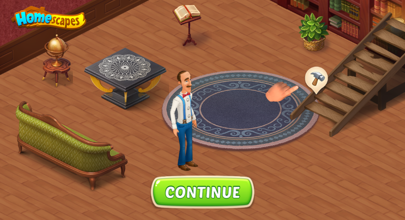

<h1 align="center">Playable для игры Homescapes-"Восстановление лестницы"</h1>

<h2 align="center">Техническое задание</h2>

Playable - это реклама, в которую можно играть. В Playable зачастую отображается
фрагмент геймплея и призыв к действию (например, установить приложение).

Необходимо сделать Playable для игры Homescapes -"Восстановление лестницы".

1. При открытии Playable мы видим комнату, Остина, логотип, кнопку, элементы
декора и старую лестницу. Элементы декора, Остин и фон отдельные картинки.

2. Через несколько секунд над лестницей появляется молоток и рука.

3. Когда пользователь тапает по молотку, молоток и рука пропадает, и появляется меню
с вариантами лестниц.

4. При переключении варианта лестницы, под соответствующим пунктом меню
появляется кнопка "Ok", а лестница в комнате меняется на выбранную. При
этом, лестница должна появляться сверху (чуть выше нужного положения)

5. После нажатия кнопки "Ok" появляется финальное окно и игрет музыка.

<h2 align="center">Использованные технологии по реализации</h2>

1. Язык реализации - JavaScript. Использовался canvas с библиотекой PixiJS.

2. Использовались анимации элементов. Использовались easing-эффекты.

